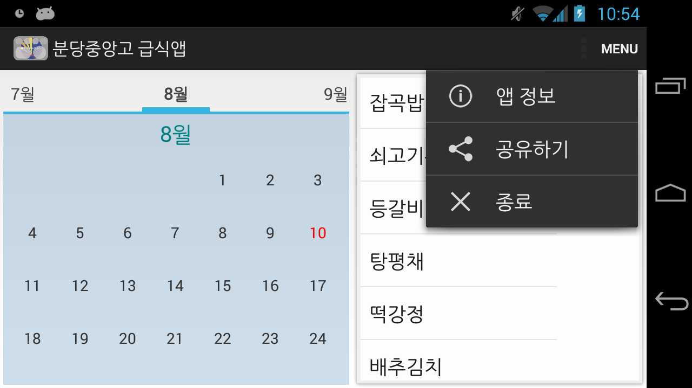
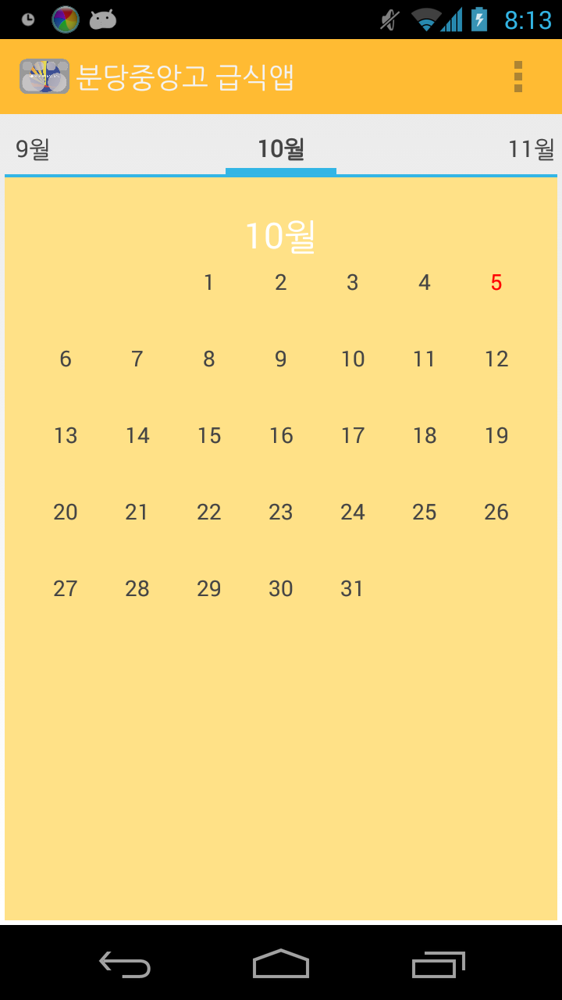

# 분당 중앙 고등학교 급식 정보 안내 앱

## 0. 분당 중앙 고등학교 급식 정보 안내 앱이란?
> 해당 앱은 모바일로 손쉽게 급식 정보를 확인할 수 있도록 분당 중앙 고등학교 재학생 및 교직원을 위해 제작한 교내 급식 알림 앱입니다.

## 1. 설계 의도
> 앱이 설계되었던 2012년~2014년 경에는 **모바일 환경에서 데이터 통신하는 비용이 비싸** 급식 정보를 알기 위해 매번 인터넷에 접속해야하는 것은 월별 데이터 한도가 정해져 있는 고등학생들에게 큰 부담이었습니다.
> 따라서, 필요한 월별 급식 데이터를 **1회성**으로 받아와 처리할 수 있는 앱이 필요했었고 처음 앱 개발을 시작한 사람으로서 이 문제를 해결할 수 있다고 생각했습니다.

## 2. 버전 별 변천사

### 1. 버전 4.8

|메인화면|달력 UI|수정 사항|크리스마스 에디션|
|:-:|:-:|:-:|:-:|
|||||

초기 앱의 모습은
 - 단순히 현재 시간을 아날로그 시간으로 표시해주고
 - 점심 시간과 석식 시간이 얼마나 남았는지를 표시해주며
 - 일주일 중 급식을 알고 싶은 특정 요일을 입력받아 급식 정보를 알려주는 UI로 구성돼 있습니다.

물론 점차 시간이 지나며 특정 요일이 아닌 특정 날짜를 기반으로 급식 정보를 알려줄 수 있도록 UI를 수정했습니다.

크리스마스와 같은 특별한 날에는 UI를 다르게 바꿔보기도 했습니다.

하지만 급식 정보에 대한 파싱을 앱에서 직접 학교 홈페이지에 접근해서 가져오게끔 만들었기 때문에 급식 정보를 잘못 가져온 경우에 대해서 각 버전별로 이를 일괄적으로 수정하여 대응하기 어려웠습니다.

### 2. 버전 4.9

|메인화면|음성인식|음성인식결과|
|:-:|:-:|:-:|
||||

4.9버전에서는 조금 더 실험적인 것들을 해봤습니다.

'가령 2주 월요일의 급식은?' 이라는 질문을 음성인식으로 받는다면,  
다음과 같이 특정 요일의 급식 정보('2주 월요일의 급식 정보')를 조회하도록 만들어 봤습니다.

|카카오톡 보내기|처리되지않은 예외|
|:-:|:-:|
|||

이외에도 당시 카카오톡 사용자가 많아 카카오톡으로 급식 내용을 전달하는 기능에 대한 요구가 있어 이를 Intent를 이용해 구현했습니다.

물론 아직까지도 처리되지 않은 예외는 많았습니다...

### 3. 버전 5.2

|수정사항|메인화면|달력UI|
|:-:|:-:|:-:|
||||

해당 버전부터는 디자인을 조금 더 다듬어 봤습니다.  
이를 위해 도서관을 들려 디자인 서적을 참고했습니다.  

|급식평가기능|예외처리|개발자정보|
|:-:|:-:|:-:|
||||

급식의 맛 평가를 할 수 있는 실험적인 기능을 잠깐 추가했습니다.  
당시 (다음소프트) 송영길 부사장의 빅데이터와 데이터마이닝에 대한 강연을 듣고나서 데이터 분석을 하고 싶어졌기 때문이었습니다.

하지만, 실제 급식 평가기능이 추가되지는 않았습니다.

전반적으로 예외 처리를 통해 불편하게 느껴질만한 부분을 개선했습니다.

개발자가 누군지 궁금해하는 사람들이 있어 개발자 정보도 추가해봤습니다.

### 4. 버전 7.0

|가로화면|세로화면|메뉴|
|:-:|:-:|:-:|
||||
||||

이때부터 디자인에 큰 변화가 있었고 꽤 안정화 되었습니다.

디자인에 대한 변화는 기존 달력 UI를 활용하되 별도의 날짜 선택 버튼을 따로 누르지 않고 첫 시작 화면부터 달력을 표시하도록 했습니다.  
그럼 사용자는 달력에 표시된 날짜를 눌러 해당하는 날짜의 급식 정보를 확인할 수 있어 더 직관적이라 판단했기 때문입니다.

또한 태블릿과 같이 가로가 큰 화면에서도 앱을 사용할 때 큰 화면을 충분히 사용할 수 있도록 당시 트랜드인 Material Design의 Fragment를 활용했습니다.  
당시 Fragment는 Android 3.0 (Honeycomb) 부터 지원했었기에 다수의 안드로이드 디바이스의 OS 버전이 Froyo~Gingerbread 인 점을 감안한다면 Fragment를 사용하기 위해 Android Support Library와 커스텀 Material 라이브러리를 사용해야 했었습니다.

|다국어지원|
|:-:|
||
||

~~혹시 그럴린 없지만...~~ 다국어 지원을 하기위해 영문 버전도 지원하기 시작했습니다. ~~당시 아랍어를 공부하는 문과 친구가 휴대폰 언어 설정을 사우디아라비아로 해놓는 경우를 보았기 때문이었습니다.~~

|푸쉬알림(가로)|푸쉬알림(세로)|급식 메뉴 확인|
|:-:|:-:|:-:|
||||
||||

또한, 별도의 PHP 백엔드를 구성해 급식을 파싱하는 모듈을 백엔드의 역할로 분리하고 앱에서는 백엔드에서 파싱한 정보만 받아서 사용했습니다.

구글 클라우드 푸시 알림(GCM)을 연동하여 다양한 용도로 사용할 수 있었습니다.  
(가령, 급식 정보가 매달 바뀔때마다 바뀐 정보를 다운받도록 유도한다든지, 축하할 일을 푸시 알림을 통해 축하해준다든지와 같은 식으로 활용할 수 있었습니다.)

### 5. 버전 7.1

이때부터 디자인에 정신이 팔려버렸습니다.

|빨|주|초|파|보|
|:-:|:-:|:-:|:-:|:-:|
||||||

어떤 색 조합을 써야 더 앱이 예뻐질까 고민하다 그냥 Android Accent Color를 기반으로 모든 색 조합을 만들어봤습니다.

(개인적으로는) 다 예뻐서 앱을 새로 실행할 때마다 랜덤으로 다른 색이 나오도록 했습니다.

|급식 텍스트 메뉴|급식 이미지 메뉴|
|:-:|:-:|
|||

개인적으로 급식 메뉴를 표현할 때, 텍스트만 있는게 많이 밋밋했었는데 급식 메뉴를 이미지로 표현할 수 있었음 좋겠다고 생각했었습니다.

그래서 구글 이미지 검색으로 해당 급식에 관련된 이미지들을 찾고 그 중 첫 번째로 검색되는 이미지를 가져와 띄워주기로 했습니다.  
물론 데이터가 많이 들 수 있는 기능이므로 최대한 한번 다운받은 데이터는 기기에 캐싱해서 재사용하도록 처리했습니다.  
이를 위해 Open Source Project인 Volley와 LRU 캐시 라이브러가 사용되었습니다.

## 3. 정리

해당 앱은 2012년 3월부터 개발하기 시작하여 2013년 12월까지 개발된 프로젝트입니다.  
따라서 현재의 기술 스택과는 다소 상이할 수 있는 점을 견지해주시기 바랍니다.

당시 개발을 진행하면서 어려운 점이 많았습니다.

 - 개발과 관련된 CS 전공 지식의 부재
 - 학업과 병행해야 했던 점
 - 모르는 것을 물어볼 만한 멘토의 부재
 - 테스트를 진행할만한 안드로이드 기기의 부재

해결책

 - 개발과 관련된 CS 전공 지식의 부재

    해당 문제는 관련된 자료를 온라인에서 찾거나 관련 서적을 사거나 인근 도서관에서 필요한 책을 빌리는 식으로 해결했습니다.
    또한 직접 코드로 구현하는 것을 지양했고 최대한 추상화가 잘 된 라이브러리를 활용했습니다.  
    물론 필요한 모듈의 경우 자바 및 안드로이드 레퍼런스를 찾아보며 구현했습니다.

 - 학업과 병행해야 했던 점

    고등학생 특성상 학교에 있는 시간에는 개발을 하기 어려웠습니다.  
    그래서 학교에 있을 때는 쉬는 시간에 요구 사항을 정리하거나 전체적인 코드의 구조를 설계하고 방학과 야간 자율학습이 끝난 밤 시간을 주로 활용해 개발을 진행했습니다.

 - 모르는 것을 물어볼 만한 멘토의 부재

    페이스북 그룹 생활코딩이나 안드로이드 개발 커뮤니티를 활용했습니다.

 - 테스트를 진행할만한 안드로이드 기기의 부재

    개발 초기에 테스트를 진행할만한 안드로이드 기기가 없어 PC 에뮬레이터를 통해 개발을 진행했습니다.